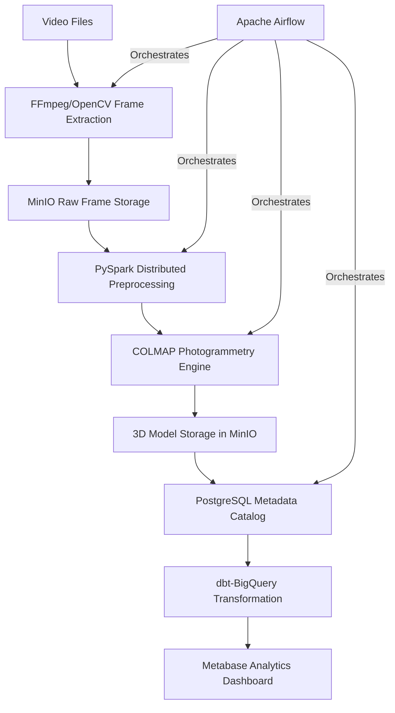

# Automated 3D Photogrammetry Pipeline

A production-grade data engineering pipeline that converts video input into textured 3D models using fully open-source components. The system demonstrates proficiency in distributed computing, workflow orchestration, and cloud-native architecture.

## Features

- Cloud-native scalable architecture
- Multi-platform support (Apple Silicon and NVIDIA GPU)
- Video-to-frames extraction for 3D reconstruction
- Distributed frame processing with PySpark
- Workflow orchestration with Apache Airflow
- S3-compatible storage with MinIO
- Infrastructure as Code with Terraform
- Quality monitoring with Evidently AI
- Data validation with Great Expectations

## Architecture



## 3D Reconstruction Pipeline

The production-ready 3D reconstruction pipeline uses COLMAP to convert videos or image sequences into 3D models.

### Prerequisites

- Docker and Docker Compose
- NVIDIA GPU (optional but recommended) 
- 16GB+ RAM recommended

### Running the Pipeline

1. Place your input data in one of these locations:
   - Videos: `data/videos/` (supported formats: .mp4, .mov, .avi)
   - Image frames: `data/input/` (supported formats: .jpg, .png)

2. Start the system:
   ```bash
   docker-compose up -d
   ```

3. Access the Airflow UI at http://localhost:8080 (default credentials: admin/admin)

4. Trigger the `reconstruction_pipeline` DAG with optional parameters:
   - `video_path`: Optional path to a specific video file
   - `quality`: Quality preset (`low`, `medium`, `high`)
   - `s3_upload`: Whether to upload results to MinIO

### Pipeline Steps

1. Check dependencies
2. Find and extract frames from video (if needed)
3. Check if frames exist
4. Create COLMAP workspace
5. Extract features
6. Match features
7. Run sparse reconstruction
8. Run dense reconstruction
9. Generate mesh
10. Copy outputs
11. Upload to MinIO (if enabled)

### Outputs

The pipeline produces the following in `data/output/models/<model_name>/`:
- Point cloud (PLY format)
- 3D mesh (PLY format)
- Camera positions
- Metadata

### Configuration

The pipeline can be configured through environment variables in the `.env` file:

- `USE_GPU`: Whether to use GPU acceleration (`auto`, `true`, or `false`)
- `QUALITY_PRESET`: Quality preset (`low`, `medium`, or `high`)
- `S3_ENABLED`: Whether to upload results to MinIO

## Getting Started

### Prerequisites

- Docker and Docker Compose
- Optional: FFmpeg (for video processing, but can use Docker-based alternative)
- Either:
  - Apple Silicon Mac (M1/M2/M3) for ARM64 architecture
  - NVIDIA GPU with CUDA support and NVIDIA Container Toolkit
- Python 3.9+

### Quick Start (Recommended)

1. Clone the repository
   ```bash
   git clone https://github.com/yourusername/photogrammetry-pipeline.git
   cd photogrammetry-pipeline
   ```

2. Run the automated setup script
   ```bash
   chmod +x run.sh
   ./run.sh
   ```

3. Access services:
   - Airflow: http://localhost:8080 (username: admin, password: admin)
   - MinIO: http://localhost:9001 (username: minioadmin, password: minioadmin)
   - Spark Master UI: http://localhost:8001

### Processing a Video

Two options are available for video processing:

Both scripts extract 1 frame per second. Adjust the last parameter to change the frame rate.

3. Run the reconstruction pipeline:
   - Access Airflow UI at http://localhost:8080
   - Trigger the 'reconstruction_pipeline' DAG
   - Monitor progress in the Airflow UI
   - Output 3D models will be in `data/output`

### Processing Images Directly

If you already have images instead of video:

1. Place your images in the `data/input` directory
2. Access Airflow UI and trigger the 'reconstruction_pipeline' DAG
3. Output 3D models will be available in the `data/output` directory

### Accessing MinIO Object Storage

MinIO provides S3-compatible object storage for the pipeline:

1. Access the MinIO console at http://localhost:9001
2. Log in with the default credentials:
   - Username: minioadmin
   - Password: minioadmin
3. Browse the default buckets:
   - raw-videos: For original video files
   - frames: For extracted video frames
   - processed-frames: For frames after preprocessing
   - models: For final 3D models

## Testing

The E2E3D pipeline includes multiple testing options to verify functionality:

### Minimal Test

Run a simplified test to verify Docker environment and sample data download:

```bash
./run_minimal_test.sh
```

This test requires minimal dependencies and verifies:
- Docker environment is working correctly
- Sample data can be downloaded
- Files are accessible via volumes

### Airflow Test

Run a simplified test through the Airflow testing framework:

```bash
./scripts/run_airflow_test.sh
```

Options:
- `--dataset <name>` - Specify which dataset to use (default: CognacStJacquesDoor)

The test verifies:
- Docker container runs with Python 3.7.9
- Sample data download works correctly
- Generates a test report in JSON format

### Test Reports

Test reports are stored in the `data/reports` directory, containing:
- System information (Python version, platform, etc.)
- Dataset information
- Test results (success/failure, number of images found)

## Troubleshooting

### Can't access Airflow UI

If you cannot access the Airflow UI at http://localhost:8080, run the troubleshooting script:

```bash
./scripts/fix_airflow.sh
```

Common solutions:
- Ensure no other service is using port 8080
- Try accessing via http://127.0.0.1:8080 instead of localhost
- Check if your firewall is blocking the connection
- Restart Docker completely

### Video Processing Issues

If you get "permission denied" errors when running scripts:
```bash
chmod +x scripts/*.sh
```

If FFmpeg is not installed, you have two options:
1. Install FFmpeg manually as described above
2. Use the Docker-based video processing script: `./scripts/docker_video_process.sh`

### Platform Issues
- If you encounter "platform mismatch" errors, rerun the setup script: `./run.sh`
- For manual troubleshooting, ensure your `.env` file contains the correct platform:
  ```
  DOCKER_PLATFORM=linux/arm64  # for Apple Silicon
  # or
  DOCKER_PLATFORM=linux/amd64  # for Intel/AMD
  ```

### NVIDIA GPU Issues
- Ensure NVIDIA drivers are installed and up-to-date
- Verify NVIDIA Container Toolkit is properly installed
- Check docker permissions for GPU access

### Apple Silicon Issues
- Ensure you're using Docker Desktop 4.15+ with improved ARM64 support
- If MinIO fails to start, try manually specifying `--platform linux/arm64` in your docker-compose.yml

## Project Structure

```
e2e3d/
├── src/                       # Source code
│   ├── reconstruction/        # Reconstruction modules
│   │   ├── colmap/            # COLMAP integration
│   │   ├── mesh/              # Mesh generation
│   │   └── cli.py             # Command-line interface
│   ├── photogrammetry/        # Photogrammetry utilities
│   └── utils/                 # Utility functions
├── docker/                    # Docker configuration
│   ├── base/                  # Base Docker image
│   ├── colmap/                # COLMAP Docker image
│   ├── airflow/               # Airflow Docker image
│   └── scripts/               # Docker entrypoint scripts
├── scripts/                   # Utility scripts
├── airflow/                   # Airflow DAGs
│   ├── dags/                  # DAG definitions
│   └── plugins/               # Airflow plugins
├── image_sets/                # Input image sets
├── data/                      # Data directory (created at runtime)
│   ├── input/                 # Input data
│   ├── output/                # Output data
│   └── videos/                # Input videos
├── reconstruct.py             # Main entry point script
├── docker-compose.yml         # Docker Compose configuration
├── requirements-*.txt         # Dependency files
└── run.sh                     # Main startup script
```

## Quick Start

### Option 1: Using Docker (Recommended)

1. Clone the repository and start the system:

```bash
git clone https://github.com/yourusername/e2e3d.git
cd e2e3d
./run.sh
```

2. Run the reconstruction pipeline on an image set:

```bash
./scripts/run_reconstruction.sh YourImageSet
```

### Option 2: Local Installation

1. Clone the repository and set up the environment:

```bash
git clone https://github.com/yourusername/e2e3d.git
cd e2e3d
pip install -r requirements-common.txt -r requirements-reconstruction.txt
./install_mesh_tools.sh
```

2. Run the reconstruction pipeline directly:

```bash
./reconstruct.py image_sets/YourImageSet --quality medium --mesh-method open3d
```

## Usage Examples

### Run Full Reconstruction Pipeline

```bash
./scripts/run_reconstruction.sh CognacStJacquesDoor
```

### Run With Custom Quality Settings

```bash
./scripts/run_reconstruction.sh CognacStJacquesDoor --quality high --depth 10 --voxel-size 0.005
```

### Run Only Mesh Generation (Skip COLMAP)

```bash
./scripts/run_reconstruction.sh CognacStJacquesDoor --skip-colmap --mesh-method open3d
```

### Using Airflow for Batch Processing

1. Access the Airflow web interface at http://localhost:8080 (username: admin, password: admin)
2. Trigger the reconstruction_pipeline DAG with parameters
3. Monitor the progress in the Airflow UI

## Documentation

- [Project Structure](docs/project-structure.md)
- [Docker Setup](docs/docker-setup.md)
- [Test Report (June 2024)](docs/test_report_20240601.md)
- [Test Report Template](docs/test_report_template.md)

## License

This project is licensed under the MIT License - see the LICENSE file for details.

# E2E3D: End-to-End 3D Reconstruction Pipeline

A comprehensive pipeline for 3D reconstruction from images, supporting both sparse and dense reconstruction methods.

## Features

- Support for both sparse and dense reconstruction methods
- Multiple mesh generation algorithms (Open3D, Poisson, Delaunay)
- Modular architecture for easy extension
- Command-line interface for easy use
- Airflow integration for workflow management
- Docker support for easy deployment

## Project Structure

```
e2e3d/
├── airflow/                # Airflow DAGs and plugins
├── data/                   # Data directory
│   ├── input/              # Input image sets
│   ├── output/             # Output reconstructions
│   └── videos/             # Input videos
├── docker/                 # Docker configuration
├── docs/                   # Documentation
├── scripts/                # Utility scripts
├── src/                    # Source code
│   ├── config/             # Configuration management
│   ├── reconstruction/     # Reconstruction code
│   ├── mesh/               # Mesh generation code
│   └── utils/              # Utility functions
├── tests/                  # Tests
├── reconstruct.py          # Main entry point
└── run.sh                  # Docker startup script
```

## Quick Start

### Local Installation

1. Clone the repository:
   ```bash
   git clone https://github.com/yourusername/e2e3d.git
   cd e2e3d
   ```

2. Create a virtual environment and install dependencies:
   ```bash
   python -m venv venv
   source venv/bin/activate  # On Windows: venv\Scripts\activate
   pip install -r requirements.txt
   ```

3. Install COLMAP:
   - On macOS: `brew install colmap`
   - On Ubuntu: `apt-get install colmap`
   - On Windows: Download from [COLMAP website](https://colmap.github.io/)

4. Install mesh generation tools:
   ```bash
   ./scripts/install_mesh_tools.sh
   ```

### Docker

1. Start the Docker environment:
   ```bash
   ./run.sh
   ```

2. Access the Airflow UI at http://localhost:8080 (username: admin, password: admin)

## Usage

### Command Line

Run reconstruction on an image set:

```bash
./reconstruct.py path/to/image/set --quality medium
```

Options:
- `--quality`: Quality preset (low, medium, high)
- `--mesh-method`: Mesh generation method (open3d, poisson, delaunay)
- `--use-gpu`: Whether to use GPU (auto, true, false)
- `--output`: Output directory
- `--skip-colmap`: Skip COLMAP reconstruction
- `--skip-mesh`: Skip mesh generation
- `--verbose`: Enable verbose output

### Visualizing Results

To visualize the generated mesh:

```bash
./scripts/visualize_mesh.py path/to/mesh.obj
```

Options:
- `--point_cloud`: Optional point cloud file to overlay
- `--color`: Mesh color as R,G,B (default: 0.8,0.8,0.8)
- `--point_size`: Point size for point cloud (default: 2.0)

### Airflow

1. Access the Airflow UI at http://localhost:8080
2. Trigger the `reconstruction_pipeline` DAG
3. Specify the image set name and other parameters

## Documentation

- [Project Structure](docs/project-structure.md)
- [Docker Setup](docs/docker-setup.md)
- [Test Report (June 2024)](docs/test_report_20240601.md)
- [Test Report Template](docs/test_report_template.md)

## License

This project is licensed under the MIT License - see the LICENSE file for details.

# Airflow Local Setup

This is a simple local setup for Apache Airflow for testing purposes. It includes a few sample DAGs to demonstrate basic ETL processes.

## Prerequisites

- Python 3.9+ installed
- pip (Python package manager)

## Setup Instructions

1. Create a virtual environment:
   ```bash
   python -m venv airflow_venv
   source airflow_venv/bin/activate  # On Windows: airflow_venv\Scripts\activate
   ```

2. Install Airflow and dependencies:
   ```bash
   pip install "apache-airflow==2.5.3" --constraint "https://raw.githubusercontent.com/apache/airflow/constraints-2.5.3/constraints-3.9.txt"
   ```

3. Initialize the Airflow database:
   ```bash
   export AIRFLOW_HOME=$(pwd)/airflow  # On Windows: set AIRFLOW_HOME=%CD%\airflow
   airflow db init
   ```

4. Create an admin user:
   ```bash
   export AIRFLOW_HOME=$(pwd)/airflow  # On Windows: set AIRFLOW_HOME=%CD%\airflow
   airflow users create \
     --username admin \
     --firstname Admin \
     --lastname User \
     --role Admin \
     --email admin@example.com \
     --password admin
   ```

## Running Airflow

1. Start the Airflow webserver:
   ```bash
   export AIRFLOW_HOME=$(pwd)/airflow  # On Windows: set AIRFLOW_HOME=%CD%\airflow
   airflow webserver --port 8080
   ```

2. In a separate terminal, start the Airflow scheduler:
   ```bash
   export AIRFLOW_HOME=$(pwd)/airflow  # On Windows: set AIRFLOW_HOME=%CD%\airflow
   airflow scheduler
   ```

3. Open your browser and navigate to http://localhost:8080
   - Login with username: `admin` and password: `admin`

## Sample DAGs

### hello_world

A simple DAG with two tasks:
1. Bash task that prints "Hello World from Bash!"
2. Python task that returns "Hello World from Python!"

### etl_pipeline

A more complex ETL pipeline that:
1. Extracts data by generating random sample data
2. Transforms the data by calculating statistics
3. Loads the data (simulated)
4. Cleans up old files

## Customizing

- Add your own DAGs to the `airflow/dags` directory
- Ensure your DAGs follow Airflow best practices
- Test your DAGs using the Airflow CLI:
  ```bash
  export AIRFLOW_HOME=$(pwd)/airflow
  airflow dags test [dag_id] [execution_date]
  ```

## Shutting Down

When you're done, press CTRL+C in both terminal windows to stop the webserver and scheduler.

## Troubleshooting

If you encounter any issues:
1. Check the Airflow logs in `airflow/logs/`
2. Verify your environment variables are set correctly
3. Make sure the correct Python version is being used
4. Ensure your DAG files are properly formatted


