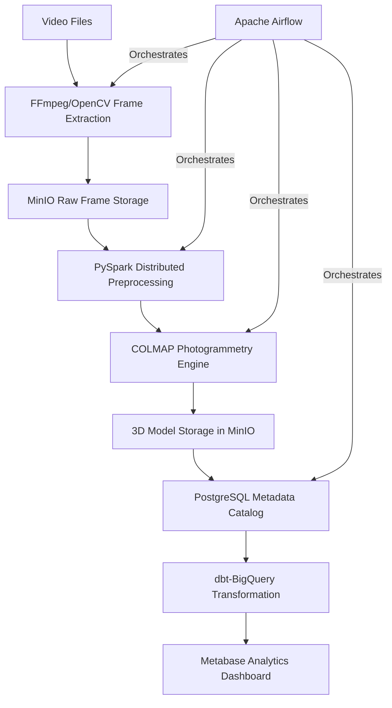

# Automated 3D Photogrammetry Pipeline

A production-grade data engineering pipeline that converts video input into textured 3D models using fully open-source components. The system demonstrates proficiency in distributed computing, workflow orchestration, and cloud-native architecture.

## Features

- Cloud-native scalable architecture
- Multi-platform support (Apple Silicon and NVIDIA GPU)
- Video-to-frames extraction for 3D reconstruction
- Distributed frame processing with PySpark
- Workflow orchestration with Apache Airflow
- S3-compatible storage with MinIO
- Infrastructure as Code with Terraform
- Quality monitoring with Evidently AI
- Data validation with Great Expectations

## Architecture



## 3D Reconstruction Pipeline

The production-ready 3D reconstruction pipeline uses COLMAP to convert videos or image sequences into 3D models.

### Prerequisites

- Docker and Docker Compose
- NVIDIA GPU (optional but recommended) 
- 16GB+ RAM recommended

### Running the Pipeline

1. Place your input data in one of these locations:
   - Videos: `data/videos/` (supported formats: .mp4, .mov, .avi)
   - Image frames: `data/input/` (supported formats: .jpg, .png)

2. Start the system:
   ```bash
   docker-compose up -d
   ```

3. Access the Airflow UI at http://localhost:8080 (default credentials: admin/admin)

4. Trigger the `reconstruction_pipeline` DAG with optional parameters:
   - `video_path`: Optional path to a specific video file
   - `quality`: Quality preset (`low`, `medium`, `high`)
   - `s3_upload`: Whether to upload results to MinIO

### Pipeline Steps

1. Check dependencies
2. Find and extract frames from video (if needed)
3. Check if frames exist
4. Create COLMAP workspace
5. Extract features
6. Match features
7. Run sparse reconstruction
8. Run dense reconstruction
9. Generate mesh
10. Copy outputs
11. Upload to MinIO (if enabled)

### Outputs

The pipeline produces the following in `data/output/models/<model_name>/`:
- Point cloud (PLY format)
- 3D mesh (PLY format)
- Camera positions
- Metadata

### Configuration

The pipeline can be configured through environment variables in the `.env` file:

- `USE_GPU`: Whether to use GPU acceleration (`auto`, `true`, or `false`)
- `QUALITY_PRESET`: Quality preset (`low`, `medium`, or `high`)
- `S3_ENABLED`: Whether to upload results to MinIO

## Getting Started

### Prerequisites

- Docker and Docker Compose
- Optional: FFmpeg (for video processing, but can use Docker-based alternative)
- Either:
  - Apple Silicon Mac (M1/M2/M3) for ARM64 architecture
  - NVIDIA GPU with CUDA support and NVIDIA Container Toolkit
- Python 3.9+

### Quick Start (Recommended)

1. Clone the repository
   ```bash
   git clone https://github.com/yourusername/photogrammetry-pipeline.git
   cd photogrammetry-pipeline
   ```

2. Run the automated setup script
   ```bash
   chmod +x run.sh
   ./run.sh
   ```

3. Access services:
   - Airflow: http://localhost:8080 (username: admin, password: admin)
   - MinIO: http://localhost:9001 (username: minioadmin, password: minioadmin)
   - Spark Master UI: http://localhost:8001

### Processing a Video

Two options are available for video processing:

Both scripts extract 1 frame per second. Adjust the last parameter to change the frame rate.

3. Run the reconstruction pipeline:
   - Access Airflow UI at http://localhost:8080
   - Trigger the 'reconstruction_pipeline' DAG
   - Monitor progress in the Airflow UI
   - Output 3D models will be in `data/output`

### Processing Images Directly

If you already have images instead of video:

1. Place your images in the `data/input` directory
2. Access Airflow UI and trigger the 'reconstruction_pipeline' DAG
3. Output 3D models will be available in the `data/output` directory

### Accessing MinIO Object Storage

MinIO provides S3-compatible object storage for the pipeline:

1. Access the MinIO console at http://localhost:9001
2. Log in with the default credentials:
   - Username: minioadmin
   - Password: minioadmin
3. Browse the default buckets:
   - raw-videos: For original video files
   - frames: For extracted video frames
   - processed-frames: For frames after preprocessing
   - models: For final 3D models

## Troubleshooting

### Can't access Airflow UI

If you cannot access the Airflow UI at http://localhost:8080, run the troubleshooting script:

```bash
./scripts/fix_airflow.sh
```

Common solutions:
- Ensure no other service is using port 8080
- Try accessing via http://127.0.0.1:8080 instead of localhost
- Check if your firewall is blocking the connection
- Restart Docker completely

### Video Processing Issues

If you get "permission denied" errors when running scripts:
```bash
chmod +x scripts/*.sh
```

If FFmpeg is not installed, you have two options:
1. Install FFmpeg manually as described above
2. Use the Docker-based video processing script: `./scripts/docker_video_process.sh`

### Platform Issues
- If you encounter "platform mismatch" errors, rerun the setup script: `./run.sh`
- For manual troubleshooting, ensure your `.env` file contains the correct platform:
  ```
  DOCKER_PLATFORM=linux/arm64  # for Apple Silicon
  # or
  DOCKER_PLATFORM=linux/amd64  # for Intel/AMD
  ```

### NVIDIA GPU Issues
- Ensure NVIDIA drivers are installed and up-to-date
- Verify NVIDIA Container Toolkit is properly installed
- Check docker permissions for GPU access

### Apple Silicon Issues
- Ensure you're using Docker Desktop 4.15+ with improved ARM64 support
- If MinIO fails to start, try manually specifying `--platform linux/arm64` in your docker-compose.yml

## Project Structure

- `src/`: Main Python package
  - `ingestion/`: Video ingestion and frame extraction
  - `processing/`: PySpark distributed processing
  - `reconstruction/`: COLMAP photogrammetry integration
  - `storage/`: MinIO storage interface
  - `monitoring/`: Quality monitoring with Evidently AI
- `airflow/`: Airflow DAGs and plugins
- `infra/`: Infrastructure as Code (Terraform, Kubernetes)
- `tests/`: Unit and integration tests
- `notebooks/`: Jupyter notebooks for exploration

## License

This project is licensed under the MIT License - see the LICENSE file for details. 


