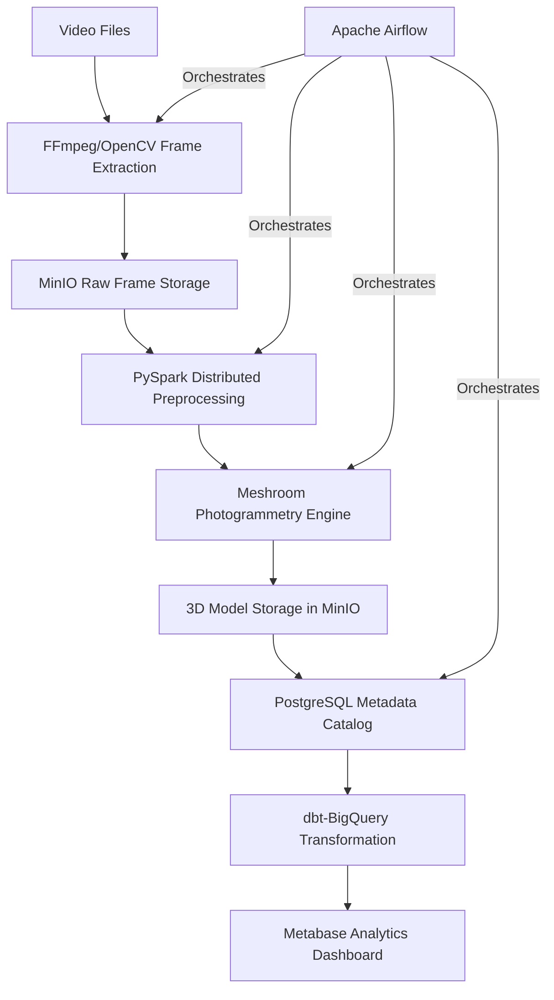

# Automated 3D Photogrammetry Pipeline

A production-grade data engineering pipeline that converts video input into textured 3D models using fully open-source components. The system demonstrates proficiency in distributed computing, workflow orchestration, and cloud-native architecture.

## Features

- Cloud-native scalable architecture
- GPU-accelerated processing
- Distributed frame processing with PySpark
- Workflow orchestration with Apache Airflow
- S3-compatible storage with MinIO
- Infrastructure as Code with Terraform
- Quality monitoring with Evidently AI
- Data validation with Great Expectations

## Architecture



## Getting Started

### Prerequisites

- Docker and Docker Compose
- NVIDIA GPU with CUDA support (optional but recommended)
- Python 3.9+

### Installation

1. Clone the repository
   ```bash
   git clone https://github.com/yourusername/photogrammetry-pipeline.git
   cd photogrammetry-pipeline
   ```

2. Set up local environment
   ```bash
   python -m venv venv
   source venv/bin/activate  # On Windows: venv\Scripts\activate
   pip install -r requirements.txt
   ```

3. Start local services
   ```bash
   docker-compose up -d
   ```

4. Access services:
   - Airflow: http://localhost:8080
   - MinIO: http://localhost:9000
   - Spark Master UI: http://localhost:8001

## Usage

1. Upload a video to MinIO bucket `raw-videos`
2. The Airflow DAG will automatically process the video
3. Output 3D models will be available in the `models` bucket

## Project Structure

- `src/`: Main Python package
  - `ingestion/`: Video ingestion and frame extraction
  - `processing/`: PySpark distributed processing
  - `reconstruction/`: Meshroom photogrammetry integration
  - `storage/`: MinIO storage interface
  - `monitoring/`: Quality monitoring with Evidently AI
- `airflow/`: Airflow DAGs and plugins
- `infra/`: Infrastructure as Code (Terraform, Kubernetes)
- `tests/`: Unit and integration tests
- `notebooks/`: Jupyter notebooks for exploration

## License

This project is licensed under the MIT License - see the LICENSE file for details. 


