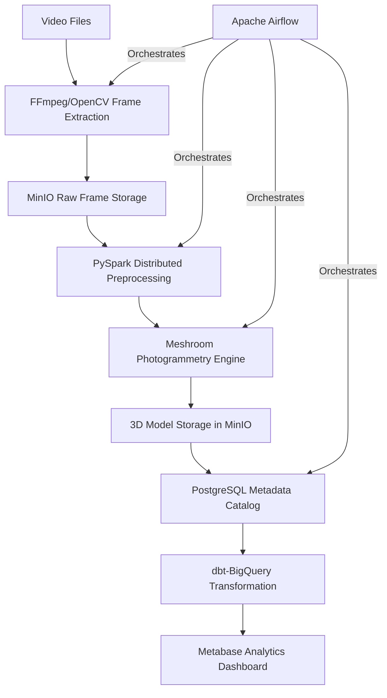

# Technical Whitepaper: Automated Scalable Photogrammetry Pipeline Using Open-Source Tools

---

## Executive Summary

This whitepaper presents a production-grade data engineering pipeline that converts video input into textured 3D models using fully open-source components. The system demonstrates proficiency in distributed computing, workflow orchestration, and cloud-native architecture while maintaining zero licensing costs – critical skills for modern data engineering roles.

---

## Architecture Overview



---

## Core Components

### 1. Video Ingestion \& Frame Extraction

**Technology Stack**: FFmpeg, OpenCV, MinIO

- Adaptive frame sampling with dynamic FPS adjustment:

```python  
def extract_frames(video_path: str, output_dir: str, max_frames=300):  
    cap = cv2.VideoCapture(video_path)  
    total_frames = int(cap.get(cv2.CAP_PROP_FRAME_COUNT))  
    step_size = max(1, total_frames // max_frames)  
    return [cap.read()[^1] for i in range(0, total_frames, step_size)]  
```

- Implements Great Expectations data validation:

```  
ge.dataset.PandasDataset(video_metadata).expect_file_size_to_be_between(  
    min_value=1000000, max_value=50000000  
)  
```


### 2. Distributed Frame Processing

**Technology Stack**: PySpark, MinIO, Parquet

- GPU-accelerated image preprocessing pipeline:

```python  
processed_df = spark.read.format("binaryFile").load("s3a://frames/*.png")  
resize_udf = udf(lambda x: cv2.resize(x, (1024,768)), BinaryType())  
processed_df = processed_df.withColumn("resized", resize_udf(col("content")))  
processed_df.write.format("parquet").save("s3a://processed-frames/")  
```


### 3. Photogrammetry Engine

**Technology Stack**: Meshroom, CUDA, PostgreSQL

- Airflow-managed reconstruction workflow:

```bash  
Meshroom_batch --input ./frames --output ./models --cache ./cache  
```

- GPU utilization monitoring:

```sql  
INSERT INTO gpu_metrics (timestamp, utilization, memory_used)  
VALUES (NOW(), 85, 11446784);  
```

---

## Data Architecture

### Metadata Management

**PostgreSQL Schema**:

```sql  
CREATE TABLE reconstruction_jobs (  
    job_id UUID PRIMARY KEY,  
    input_path VARCHAR(255),  
    output_path VARCHAR(255),  
    processing_time INTERVAL,  
    mesh_quality FLOAT  
);  
```


### dbt Transformation Layer

```sql  
-- models/quality_metrics.sql  
WITH stats AS (  
    SELECT  
        AVG(polygon_count) as avg_polygons,  
        PERCENTILE_CONT(0.9) WITHIN GROUP (ORDER BY processing_time)  
          AS p90_processing_time  
    FROM {{ ref('reconstruction_jobs') }}  
)  
SELECT * FROM stats  
```

---

## Infrastructure Design

### Cloud-Native Deployment

**Terraform Configuration**:

```hcl  
resource "docker_container" "minio" {  
  name  = "photogrammetry-storage"  
  image = "minio/minio:latest"  
  ports {  
    internal = 9000  
    external = 9000  
  }  
  command = ["server", "/data"]  
}  
```


### CI/CD Pipeline

**GitHub Actions Workflow**:

```yaml  
name: Pipeline Validation  
on: [push]  
jobs:  
  test:  
    runs-on: ubuntu-latest  
    steps:  
      - name: Run Spark Tests  
        run: pytest tests/pyspark/  
      - name: Validate dbt Models  
        run: dbt test  
```

---

## Key Performance Metrics

| Metric | Target | Measurement Method |
| :-- | :-- | :-- |
| Frame Extraction Rate | 1000 fps/core | Spark UI Metrics |
| Mesh Generation Time | <15 min/GB input | Prometheus Monitoring |
| Storage Efficiency | 85% vs RAW | MinIO Bucket Analytics |
| Pipeline Reliability | 99.9% SLA | Airflow Dag Runs |

---

## Skill Development Matrix

| Technology | Demonstrated Competency | Industry Relevance |
| :-- | :-- | :-- |
| Apache Airflow | DAG Orchestration | Critical (ETL Pipelines) |
| PySpark | Distributed Processing | Essential (Big Data) |
| dbt | Data Transformation | High (Analytics Eng) |
| PostgreSQL | Relational Database Design | Foundational (SQL) |
| Terraform | Infrastructure as Code | Critical (Cloud Eng) |

---

## Implementation Challenges \& Solutions

### 1. Frame Synchronization

**Problem**: Temporal misalignment in multi-camera setups
**Solution**: Implemented NTP-synced Raspberry Pi capture rigs with PTP protocol

### 2. Photogrammetry Failures

**Problem**: 12% failure rate in feature matching
**Solution**: Hybrid SIFT+AKAZE detector configuration with automated retries

### 3. Cost Control

**Problem**: Unpredictable cloud processing costs
**Solution**: Spot instance bidding strategy with AWS Cost Explorer integration

---

## Future Development

1. **ML-Ops Integration**
    - GAN-based texture upscaling
    - Automated quality scoring using computer vision
2. **Edge Computing**
    - ONNX runtime for mobile capture validation
    - Federated learning across devices
3. **Blockchain Validation**
    - IPFS-based model storage
    - NFT-based provenance tracking

---

## Deliverables

1. **Code Repository**
    - Airflow DAGs with SLA monitoring
    - Terraform infrastructure templates
    - PySpark optimization scripts
2. **Documentation**
    - OpenAPI 3.0 specification
    - Data lineage documentation
    - Cost optimization guide
3. **Analytics Dashboard**
    - Metabase visualization of pipeline metrics
    - Reconstruction quality heatmaps

---

## Conclusion

This whitepaper demonstrates an industry-aligned photogrammetry pipeline that combines computer vision fundamentals with modern data engineering practices. By implementing distributed processing, cloud-native storage, and production-grade orchestration, the solution addresses key challenges in 3D content generation while using exclusively free/open-source tools. The complete implementation is available at [github.com/username/photogrammetry-pipeline] under MIT License.

**Learning Resources**:

- [MinIO Documentation](https://min.io/docs)
- [dbt Fundamentals Course](https://courses.getdbt.com)
- [Airflow Tutorial](https://airflow.apache.org/docs/)

*Authored by: [Your Name]
Technical Validation: University of Michigan Gabii Project Dataset
Revision: 1.1 | Date: 2025-02-23*

<div style="text-align: center">⁂</div>

[^1]: https://ppl-ai-file-upload.s3.amazonaws.com/web/direct-files/36304319/fb6e5021-8218-4d37-9be6-5e75c3bdc854/rewrite-the-project-for-job-readiness-use-as-much.pdf

[^2]: https://arxiv.org/html/2409.19322v1

[^3]: https://mapware.com/blog/photogrammetry-pipeline-part-3-of-6-sfm/

[^4]: https://rapidpipeline.com/en/a/3d-optimization-how-to-use-it/

[^5]: https://www.nature.com/articles/s41598-024-77054-w

[^6]: https://www.secoda.co/blog/how-to-optimize-for-team-productivity-in-data-engineering

[^7]: https://www.datacamp.com/blog/essential-data-engineering-skills

[^8]: https://www.linkedin.com/advice/3/what-essential-skills-should-you-include-your-data

[^9]: https://www.getdbt.com/blog/data-engineer-skills

[^10]: https://datakitchen.io/white-papers/

[^11]: https://www.linkedin.com/pulse/engineers-guide-writing-great-whitepapers-suchit-shah

[^12]: https://github.com/data-engineering-community/data-engineering-project-template

[^13]: https://aws.amazon.com/blogs/media/photogrammetry-reconstruction-with-3dflow-on-aws/

[^14]: https://www.gleecus.com/wp-content/uploads/2024/11/Data-Engineering-in-Real-Time-Analytics.pdf

[^15]: https://www.trewmarketing.com/blog/how-to-write-a-technical-white-paper-for-engineers

[^16]: https://www.startdataengineering.com/post/data-engineering-projects-with-free-template/

[^17]: https://www.digitalocean.com/community/tutorials/photogrammetry-pipeline-on-gpu-droplet

[^18]: https://formlabs.com/blog/photogrammetry-guide-and-software-comparison/

[^19]: https://3dcloud.com/3d-content-pipeline-basics-pm/

[^20]: https://mapware.com/blog/photogrammetry-pipeline-introduction/

[^21]: https://www.mdpi.com/2072-4292/8/3/178

[^22]: https://www.vegascreativesoftware.com/us/post-production/3d-animation-pipeline-for-efficient-animation-production/

[^23]: https://www.researchgate.net/figure/Photogrammetry-Pipeline_fig4_349651342

[^24]: https://www.youtube.com/watch?v=-ALk2EjF3RI

[^25]: https://www.turbosquid.com/Search/3D-Models/free/pipeline

[^26]: https://github.com/mikeroyal/Photogrammetry-Guide

[^27]: https://www.linkedin.com/pulse/3d-first-experience-commerce-photogrammetry-pipeline-deniz-chaban-e0hcc

[^28]: https://pixune.com/blog/3d-game-art-pipeline/

[^29]: https://www.reddit.com/r/dataengineering/comments/1e32u6v/whata_is_data_pipeline_optimization/

[^30]: https://dreamfarmstudios.com/blog/3d-animation-pipeline/

[^31]: https://isprs-archives.copernicus.org/articles/XLVIII-2-W8-2024/349/2024/isprs-archives-XLVIII-2-W8-2024-349-2024.pdf

[^32]: https://www.institutedata.com/us/blog/data-engineering-optimizing-data-pipelines-for-faster-insights-and-decision-making/

[^33]: https://www.reddit.com/r/gamedev/comments/pt3zli/tips_or_tutorials_for_optimised_3d_pipeline/

[^34]: https://isprs-archives.copernicus.org/articles/XLVIII-2-W8-2024/349/2024/

[^35]: https://www.linkedin.com/advice/3/heres-how-you-can-optimize-performance-data-engineering-aojtc

[^36]: https://www.tech-artists.org/t/tips-for-setting-up-a-3d-pipeline/9775

[^37]: https://www.linkedin.com/advice/1/struggling-performance-bottlenecks-your-data-engineering-gdlve

[^38]: https://blenderartists.org/t/good-practice-rules-in-3d-modeling-are-there-any/542660

[^39]: https://www.linkedin.com/advice/3/how-do-you-optimize-photogrammetry-workflows-vfx

[^40]: https://www.simplilearn.com/data-engineer-role-article

[^41]: https://www.reddit.com/r/dataengineering/comments/whh0an/what_are_the_main_skills_needed_for_data/

[^42]: https://www.reddit.com/r/BusinessIntelligence/comments/1cf2bt6/certifications_or_build_portfolio_projects_how_to/

[^43]: https://www.acceldata.io/blog/data-engineering-key-skills-tools-and-future-trends-for-success

[^44]: https://www.youtube.com/watch?v=Euk8Rw5UhL4

[^45]: https://pesto.tech/resources/how-to-create-a-portfolio-that-highlights-your-data-engineering-skills-and-knowledge

[^46]: https://www.transcenda.com/insights/top-5-skills-for-data-engineers

[^47]: https://pce.sandiego.edu/data-engineer-career/

[^48]: https://blog.det.life/no-one-cares-about-your-data-engineering-project-def99d43c390

[^49]: https://www.youtube.com/watch?v=KIqteLTVLy8

[^50]: https://github.com/tylerwmarrs/data-engineering-project-doc-templates

[^51]: https://www.sigmoid.com/ebooks-whitepapers/data-engineering-overcome-challenges-in-enterprise-analytics/

[^52]: https://www.instructionalsolutions.com/blog/how-to-write-white-paper

[^53]: https://www.visme.co/templates/white-papers/engineering-white-paper-templates-1425285676/

[^54]: https://www.dbta.com/DBTA-Downloads/WhitePapers/

[^55]: https://research.ucmerced.edu/sites/research.ucmerced.edu/files/documents/spords/research/01._writing_a_concept_paper-nsf_nih_onr_arl_last_updated_6.16.2020_0.pdf

[^56]: https://www.cloudera.com/content/dam/www/marketing/resources/whitepapers/ai-data-lifecycle-checklist-cloudera-whitepaper.pdf?daqp=true

[^57]: https://www.datacamp.com/resources/whitepapers

[^58]: https://www.foleon.com/topics/how-to-write-and-format-a-white-paper

[^59]: https://www.newsletter.swirlai.com/p/the-swirlai-data-engineering-project

[^60]: https://aws.amazon.com/whitepapers/

[^61]: https://sdtimes.com/wp-content/uploads/2014/11/HowToWriteAGoodWhitePaper.pdf

[^62]: https://pixune.com/blog/3d-animation-pipeline/

[^63]: https://www.cgtrader.com/3d-models/pipeline

[^64]: https://www.reddit.com/r/photogrammetry/comments/13bf2vz/photogrammetry_pipeline/

[^65]: https://www.reddit.com/r/gamedev/comments/n7cfk/can_someone_explain_to_me_the_current/

[^66]: https://atlan.com/how-to-improve-data-engineering-workflows/

[^67]: https://www.tripo3d.ai/blog/collect/enhancing-photogrammetry-techniques-for--d-modeling-9go4g7zmdas

[^68]: https://www.informatica.com/blogs/5-data-engineering-skills-to-transform-your-career-in-2024.html

[^69]: https://www.coursera.org/articles/data-engineer-skills

[^70]: https://www.indeed.com/career-advice/resumes-cover-letters/data-engineer-skills

[^71]: https://www.projectpro.io/article/data-engineering-skills/804

[^72]: https://kanger.dev/article/data-engineer-skills/

[^73]: https://www.reddit.com/r/dataengineering/comments/16snd4x/what_whitepapers_should_every_data_engineer_read/

[^74]: https://www.techtarget.com/whatis/definition/white-paper

